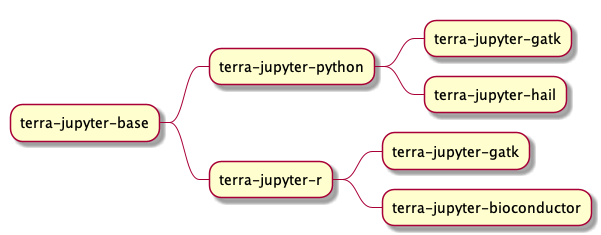

This repo provides docker images for running jupyter notebook in [Terra](https://app.terra.bio)

## Contributing

Make sure to go through the [contributing guide](https://github.com/DataBiosphere/terra-docker/blob/master/CONTRIBUTING.md#contributing) as you make changes to this repo.

# Terra Base Images
[terra-jupyter-base](terra-jupyter-base/README.md)

[terra-jupyter-python](terra-jupyter-python/README.md)

[terra-jupyter-r](terra-jupyter-r/README.md)

[terra-jupyter-hail](terra-jupyter-hail/README.md)

[terra-jupyter-gatk](terra-jupyter-gatk/README.md)

[terra-jupyter-bioconductor](terra-jupyter-bioconductor/README.md)

# How to create your own Custom image to use with notebooks on Terra
Custom docker images need to use a Terra base image (see above) in order to work with the service that runs notebooks on Terra.
* You can use any of the base images above
* Here is an example of how to build off of a base image: Add `FROM us.gcr.io/broad-dsp-gcr-public/terra-jupyter-base:0.0.1` to your dockerfile (`terra-jupyter-base` is the smallest image you can extend from)
* Customize your image (see the [terra-jupyter-python](terra-jupyter-python/Dockerfile) dockerfile for an example of how to extend from one of our base images
* Publish the image to either GCR or Dockerhub; the image must be public to be used
* Use the published container image location when creating notebook runtime
* Dockerhub image example: [image name]:[tag]
* GCR image example: us.gcr.io/repository/[image name]:[tag]
* Since 6/28/2021, we introduced a few changes that might impact building custom images
    - Home directory of new images will be `/home/jupyter`. This means if your dockerfile is referencing `/home/jupyter-user` directory, you need to update it to $HOME (recommended) or `/home/jupyter`.
    - Creating VMs with custom images will take much longer than terra supported images because `docker pull` will take a few min. If the custom image ends up being too large, VM creation may time out. New base images are much larger in size than previous versions.

# Development
## Using git secrets
Make sure git secrets is installed:
```
brew install git-secrets
```
Ensure git-secrets is run: If you use the rsync script to run locally you can skip this step

```
cp -r hooks/ .git/hooks/
chmod 755 .git/hooks/apply-git-secrets.sh
```

## Run/developing smoke_test.ipynb file locally
Run your image locally with the repo directory mounted into the container. For example
```
docker run -d -p <port_number>:8000 -v <your_local_path_to_the_repo>/terra-docker:/home/jupyter -it us.gcr.io/broad-dsp-gcr-public/terra-jupyter-r:test
```

Once you have the container running, you should be able to access jupyter at http://localhost:<port_number>/notebooks. You should be able to navigate to the smoke test ipynb file you're interested in, and run a cell. After you modify a smoke test `.ipynb` file, go to `Cell` -> `All Ouput` -> `Clear` to clear all outputs to keep the `.ipynb` files smaller.

## Generate New Image or Update Existing Image

Detailed documentation on how to integrate the terra-docker image with Leonardo can be found [here](https://broadworkbench.atlassian.net/wiki/spaces/IA/pages/2519564289/Integrating+new+Terra+docker+images+with+Leonardo)

### If you are adding a new image:
- Create a new directory with the Dockerfile and a CHANGELOG.md. 
- Add the directory name (also referred to as the image name) as an entry to the image_data array in the file in config/conf.json. For more info on what is needed for a new image, see the section on the config
- If you wish the image to be baked into our custom image, which makes the runtime load significantly faster (recommended), make a PR into the leonardo [repo](https://github.com/DataBiosphere/leonardo) doing the following within the `jenkins` folder:
    - Add the image to the parameter list in the Jenkinsfile
    - Update the relevant `prepare` script in each subdirectory. Currently there is a prepare script for gce and dataproc.
    - It is recommended to add a test in the `automation` directory (`automation/src/test/resources/reference.conf`)
    - Add your image to the `reference.conf` in the automation directory. This will be the only place any future version updates to your image happen. This ensures, along with the test in the previous step, that any changes to the image are tested.
    - Run the GHA to generate the image, and add it to `reference.conf` in the http directory (`http/src/main/resources/reference.conf`)

### If you are updating an existing image:
- [Create your terra-docker PR](https://broadworkbench.atlassian.net/wiki/spaces/IA/pages/2519564289/Integrating+new+Terra+docker+images+with+Leonardo#1.-Create-a-terra-docker-PR)
    - Update the version in config/conf.json
    - Update CHANGELOG.md and VERSION file
    - Ensure that no `From` statements need to be updated based on the image you updated (i.e., if you update the base image, you will need to update several other images)
    - Run updateVersions.sc to bump all images dependent on the base
- [Merge your terra-docker PR and check if the image(s) and version json files are created](https://broadworkbench.atlassian.net/wiki/spaces/IA/pages/2519564289/Integrating+new+Terra+docker+images+with+Leonardo#2.-Merge-your-terra-docker-PR-and-check-images-are-created)
- [Open a PR in leonardo](https://broadworkbench.atlassian.net/wiki/spaces/IA/pages/2519564289/Integrating+new+Terra+docker+images+with+Leonardo#3.-Create-a-new-leo-PR-that-integrates-the-new-images)
    - Update the relevant `prepare` script within the `jenkins` folder
    - Update the automation `reference.conf` file
- [Run the GHA on your branch to generate the new image](https://broadworkbench.atlassian.net/wiki/spaces/IA/pages/2519564289/Integrating+new+Terra+docker+images+with+Leonardo#4.-Run-the-Github-Action-in-leo-to-generate-a-new-custom-COS-image)
- [Update the leonardo PR to use the newly generated image](https://broadworkbench.atlassian.net/wiki/spaces/IA/pages/2519564289/Integrating+new+Terra+docker+images+with+Leonardo#5.-Update-the-Leo-PR-to-use-the-generated-OS-images)
- Ensure that the `terra-docker-versions-candidate.json` file (which is what the UI sources the dropdown from) in the `terra-docjker-image-documentation-[env]` bucket correclty references your new docker image
- [Update the terra-docker version candidate json](https://broadworkbench.atlassian.net/wiki/spaces/IA/pages/2519564289/Integrating+new+Terra+docker+images+with+Leonardo#6.-Update-terra-docker-versions-candidate.json)

## Testing your image manually

Build the image:
run `docker build [your_dir] -t [name]`.

`docker build terra-jupyter-base -t terra-jupyter-base`

If you're on an M1 and building an image from a locally built image, replace the current FROM command:

`FROM --platform=linux/amd64 terra-jupyter-base`

It is not advised to run build.sh locally, as this will push to the remote docker repo and delete the image locally upon completion. 

All images can be run locally. For example:
```
docker run --rm -it -p 8000:8000 us.gcr.io/broad-dsp-gcr-public/terra-jupyter-base:0.0.7
```
Then navigate a browser to http://localhost:8000/notebooks to access the Jupyter UI.

You can gain root access and open a bash terminal as follows:
```
docker run --rm -it -u root -p 8000:8000 --entrypoint /bin/bash us.gcr.io/broad-dsp-gcr-public/terra-jupyter-base:0.0.7
```

Running locally is conventient for quick development and exploring the image. However it has some limitations compared to running through Terra. Namely:
- there are no service account credentials when run locally
- there are no environment variables like `GOOGLE_PROJECT`, `WORKSPACE_NAME`, `WORKSPACE_BUCKET`, etc when running locally
- there is no workspace-syncing when run locally

To launch an image through Terra, navigate to https://app.terra.bio or your BEE's UI, select a workspace, enter your new image in the "Custom Image" field, and click Create.

## Automation Tests
[Here](https://github.com/DataBiosphere/leonardo/tree/develop/automation/src/test/scala/org/broadinstitute/dsde/workbench/leonardo/notebooks) are automation tests for various docker image, please update the image hash for relevant tests. You can run the job build-terra-docker to automatically create a PR with your branch if you manually specify versions.

## Config

There is a config file located at `config/conf.json` that contains the configuration used by all automated jobs and build scripts that interface with this repo. 

There is a field for "spark_version" top-level which must be updated if we update the debian version used in the custom image. 
Currently it assumes 1.4x https://cloud.google.com/dataproc/docs/concepts/versioning/dataproc-release-1.4

There are some constants included, such as the tools supported by this repo. Of particular interest is the image_data array.

Each time you update or add an image, you will need to update the appropriate entry in this array:
```
{
    "name": "terra-jupyter-base", //the name of the image. should correspond to the directory it is located

    "base_label": "Minimal",      //the base name used in the UI for this image. This is appended with some information about the packages in this image.

    "tools": ["python"],          //the tools present in this image. see the top-level "tools" array for valid entries. 
                                  //The significance of 'tools' is that there is expected to be an entry in the documentation specifying the version of this tool
                                  //If you wish to add a tool, you will need to add a handler to the function get_doc_builder in generate_package_documentation.py

    "packages": { "python": ["pandas"] },               //The packages that we wish to single out to display to the user at a later date. 
                                  //The difference between a package and a tool is that a tool can have a set of packages associated with it (i.e. pip packages for python)
                                  // A package  must have a tool associated with it
    "version": "0.0.4",           //The current version the image is at

    "automated_flags": {          //Flags used as control flow for scripts

        "generate_docs": true,    //Whether documentation should be auto-generated for this image. This is superceded by the build flag (i.e. if build=false, this flag is ignored)

        "build": true,            //Whether or not the jenkins job that builds the docker images in this repo should build this image

        "include_in_custom_dataproc": true,  //Whether or not the jenkins job that builds the custom dataproc image should include this image. 
                                            //This is superceded by the build flag
        "include_in_ui": true, // Whether or not this should be included in the .json file that power the terra ui dropdown for available images
        "include_in_custom_gce": true, //Whether or not the jenkins job that builds the custom gce image should include this image.
                                 //This is superceded by the build flag   
        "requires_spark": true // Whether or not this image requires a dataproc cluster to run (as opposed to most, which just need a GCE VM)
    }   
},
```

## Scripts

The scripts folder has scripts used for building.
- `generate_package_docs.py` This script is run once by build.sh each time an image is built. It is used to generate a .json with the versions for the packages in the image.
- `generate_version_docs.py` This script is run each time an image is built. It builds a new file master version file for the UI to look up the current versions to reference. 

## Image dependencies

Note that this dependency graph needs to be updated!


## Push Images to GCR

To push images to Broad managed Google Container Registry``gcr.io/broad-dsp-gcr-public``, manually trigger ``Publish image to GCR `` Github action and choose the image to push.