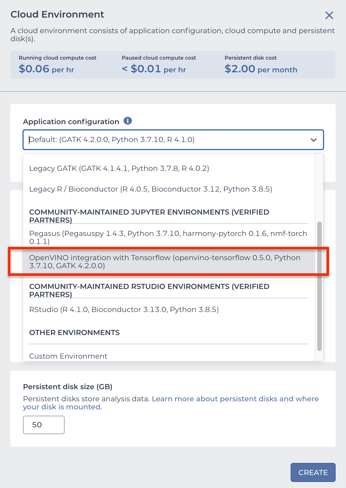

# terra-jupyter-gatk-ovtf image

This repo contains the `terra-jupyter-gatk-ovtf` image that is compatible with notebook service in [Terra](https://app.terra.bio/) called Leonardo. 

To use this in [Terra](https://app.terra.bio/), use `us.gcr.io/broad-dsp-gcr-public/terra-jupyter-gatk-ovtf:<tag>` as image identifier. See [CHANGELOG.md](CHANGELOG.md) for the most recent tag.

In Terra, this image is available in the drop-down menu under **COMMUNITY-MAINTAINED JUPYTER ENVIRONMENTS**



## Image contents

The `terra-jupyter-gatk-ovtf` docker image extends the [terra-jupyter-python](../terra-jupyter-python/README.md) and [terra-jupyter-r](../terra-jupyter-r/README.md) by including the following:

- Open JDK
- GATK
- Samtools
- [OpenVINO integration with TensorFlow](https://github.com/openvinotoolkit/openvino_tensorflow) (OVTF)

To see the complete contents of this image please see the [Dockerfile](./Dockerfile).

## Sample Notebook

This repo provides a sample notebook [GATK-OVTF-Notebook.ipynb](./GATK-OVTF-Notebook.ipynb) which showcases the performance benefits obtained by using OpenVINO™ integration with TensorFlow.

## Note on CUDA-enabled GPU devices Support

Enabling OpenVINO™ integration with TensorFlow disables TensorFlow GPU support for CUDA-enabled devices in this docker image. 
If you prefer to use CUDA-enabled GPU devices, DONOT import openvino_tensorflow

#### Scenario #1: Use CUDA-enabled GPU devices with native Tensorflow.
After installing CUDA drivers in the host machine, you will need to start the docker with `--gpus all` to enable GPU devices inside docker container. 

Example: `docker run --gpus all --rm -it -p 8000:8000 terra-jupyter-gatk-ovtf`, Then navigate a browser to http://localhost:8000/notebooks to access the Jupyter UI. 

```
import tensorflow as tf
# CPU and GPU support available. openvino_tensorflow is disabled
tf.config.list_physical_devices()
```

#### Scenario #2: Use OpenVINO™ integration with TensorFlow
```
import tensorflow as tf
import openvino_tensorflow as ovtf
ovtf.set_backend("CPU")

# By importing openvino_tensorflow, CUDA-enabled GPU devices support is disabled. 
# To re-enable GPU support, restart the Jupyter kernel, and remove "import openvino_tensorflow as ovtf"
```

#### Scenario #3: Use GATK with CUDA-enabled GPU devices
In this Docker image, GATK is enabled with OpenVINO™ integration with TensorFlow by default.
If you prefer to use GATK with CUDA-enabled GPU devices, then OpenVINO integration with TensorFlow should be disabled before executing GATK CNNScoreVariants. To disable OpenVINO™ integration with TensorFlow, run the command below in the Jupyter notebook.
```   
! export OPENVINO_TF_DISABLE=1
```
 
#### Scenario #4: Use OpenVINO™ integration with TensorFlow with CUDA-enabled GPU devices

Not Supported. 

---------


## Build and Run Instructions - **Locally**

- ### Clone the repository

  ```bash
  git clone https://github.com/DataBiosphere/terra-docker

  ```

- ### Build the docker image

  ```bash
  cd terra-docker/terra-jupyter-gatk-ovtf
  docker build . -t terra-jupyter-gatk-ovtf
  ```

- ### Run the container, Then navigate a browser to http://localhost:8000/notebooks to access the Jupyter UI

  ```bash
  docker run --rm -it -p 8000:8000 terra-jupyter-gatk-ovtf
  ```

- ### You can gain root access and open a bash terminal as follows:

  ```bash
  docker run --rm -it -u root -p 8000:8000 --entrypoint /bin/bash terra-jupyter-gatk-ovtf
  ```

## Selecting prior versions of this image

To select an older version this image, you can search the [CHANGELOG.md](./CHANGELOG.md) for a specific package version you need.

Once you find an image version that you want, simply copy and paste the image url from the changelog into the corresponding custom docker field in the Terra notebook runtime widget.
